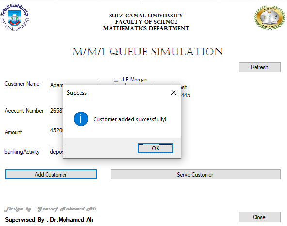

#MM1QueueSimulation
  <h1> MM1-Queue Simulation</h1>
  
<p align="center"></p>

  <h2>About</h2>
  <h3> This app separate to two layers , base layer contain logic code and presentation layer contain GUI</h3>
  <p>Modeling and simulation WinForm application for simulate MM1-Queue.</p>
  <p>This is educational project for Modeling and simulation</p>
  <h2>Installation</h2>
  <p>1. Install Repo </p>

```
https://github.com/JoeGitHubPro/BreadcrumbsMM1QueueSimulation
```


<p>3. Run Application</p>

  <h2>Usage</h2>
  <p>Main and first window to view clients queue and its details</p>
  <p align="center"></p>
  <p>This window to add new comer.</p>
  <p align="center"></p>
  <p>Added successfully.</p>
  <p align="center"></p>
  <p>This window to serve client and go from queue.</p>
  <p align="center"></p>

   <h2>Contributing</h2>
  <p>Contributions are welcome! If you'd like to contribute to this project, please follow these steps:</p>
  <ol>
    <li>Fork the repository.</li>
    <li>Create a new branch for your feature or bug fix.</li>
    <li>Make your changes and commit them.</li>
    <li>Push your changes to your forked repository.</li>
    <li>Submit a pull request detailing your changes.</li>
  </ol>
  
  <h2>License</h2>
  <p>This project is licensed under the MIT</p>

  <h2>Contact</h2>
  <p>If you have any questions or suggestions, feel free to reach out to the project owner:</p>
  <ul>
    <li>GitHub: <a href="https://github.com/JoeGitHubPro">JoeGitHubPro</a></li>
  </ul>

  <h2>Acknowledgments</h2>
  <p>C# , WinForm , OOP , DS&A.</p>

  <h2>Repository</h2>
  <p>Find the repository for this project on GitHub: <a href="https://github.com/JoeGitHubPro/ModelingAndSimulationGUI.git">Modeling And SimulationG</a></p>
